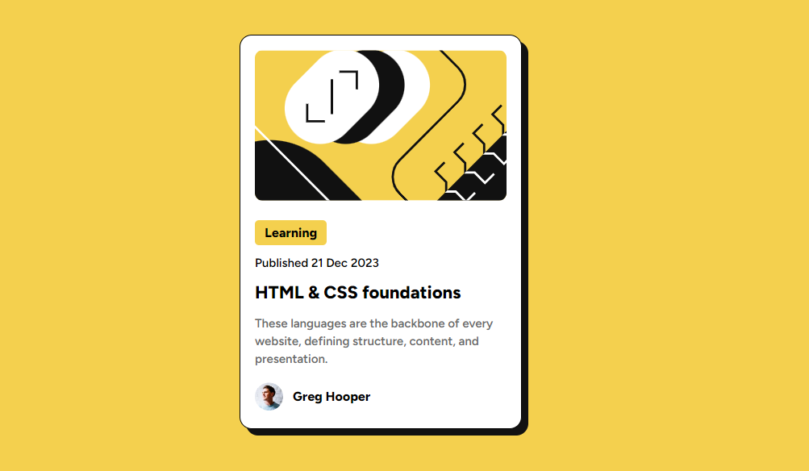

# Frontend Mentor - Blog preview card solution

## Welcome! 👋

Thanks for checking out this front-end coding challenge.

## Table of contents

- [Overview](#overview)
  - [The challenge](#the-challenge)
  - [Screenshot](#screenshot)
  - [Links](#links)
- [My process](#my-process)
  - [Built with](#built-with)
- [Author](#author)

## Overview

### The challenge

Users should be able to:

- See hover and focus states for all interactive elements on the page

### Screenshot

### Links

- Solution URL: [https://github.com/abhi123-rgb/blog-preview-card]
- Live Site URL: [Add live site URL here]

### Built with

- Semantic HTML5 markup
- CSS custom properties
- Flexbox

## Author

- Website - [Abhishek N.M]()
- Frontend Mentor - [@abhi123-rgb](https://www.frontendmentor.io/profile/abhi123-rgb)
- Twitter - [@AbhishekNM90072](https://x.com/AbhishekNM90072?t=BcUfBwBF1rxCxOG3MduVDQ&s=09)

